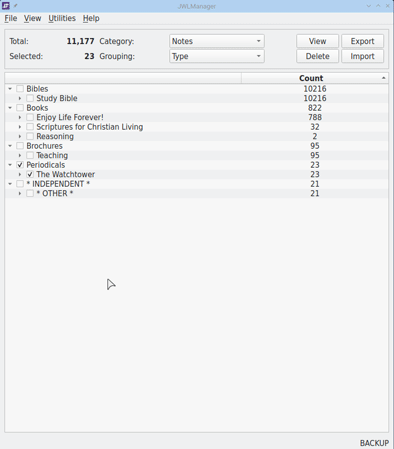

# JWLManager
**Looking for help with translation on [Weblate](https://hosted.weblate.org/engage/jwlmanager/)**[^*]   

## Purpose

This is a **multi-platform application**[^#] for viewing and performing various operations on the *user* data stored in a *.jwlibrary* backup archive (created from within the **JW Library** app[^1]: Personal Study → Backup and Restore → Create a backup). A modified *.jwlibrary* archive can then be restored within the app.

In addition to the main functions of **viewing, exporting, importing, and deleting**, the application can also clean up any residual/unused records from the database and re-index the various tables within the database. Items from different backups can be **merged** by exporting the desired items and importing them into an existent archive or into a new one.

Keep in mind that the more items there are to be sorted into a tree structure, the longer it will take. Also, *do* keep a backup until you're convinced all is well ;-)



____
## Usage

You can [download](https://github.com/erykjj/jwlmanager/releases/latest) (unzip if necessary) and launch the latest **Linux binary**, **Windows executable**, or **macOS app**. These are self-contained packages (with Python and dependencies included).

See [here](https://github.com/erykjj/jwlmanager/blob/master/.github/SECURITY.md) for information about **security alerts**, etc. The Linux binary needs to be given execute permissions: `chmod +x JWLManager_*` .

You can launch the GUI in the desired language by appending the corresponding language code parameter. So, if you want to start the app in Spanish (instead of the default English), you would invoke it as...
- Linux terminal: `python3 JWLManager.py -es`
- Windows Comand Prompt (or shortcut): `JWLManager.exe -es`
- macOS Terminal: `open -a JWLManager.app --args -es`

Preferably, if you have Python 3 installed and can install some of the required libraries/dependencies[^2], [download](https://github.com/erykjj/jwlmanager/releases/latest) and extract the latest release source code; then execute to run (from inside JWLManager folder):

```
python3 JWLManager.py
```

Or, make it executable first and run directly:

```
chmod +x JWLManager.py
./JWLManager.py
```

If you use the `-h` flag, you'll see the following options:

```
usage: JWLManager.py [-h] [-v] [-en | -es | -fr | -it | -pt]

Manage .jwlibrary backup archives

options:
  -h, --help     show this help message and exit
  -v, --version  show version and exit

interface language:
  English by default

  -en            English (default)
  -es            Spanish (español)
  -fr            French (français)
  -it            Italian (italiano)
  -pt            Portuguese (Português)
```
____
## Operation

See [here](res/HELP.md) for an explanation of how to use.

____
## Feedback

Feel free to [get in touch](https://github.com/erykjj/jwlmanager/issues) and post any issues and suggestions.

[](https://github.com/erykjj/jwlmanager/releases.atom)

____
[^#]: Requirements: Linux, MS Windows 10/11, macOS 11 "Big Sur" and newer
[^*]: Chinese, German, Japanese, Polish and Russian; other volunteers also appreciated.
[^1]: [JW Library](https://www.jw.org/en/online-help/jw-library/) is a registered trademark of *Watch Tower Bible and Tract Society of Pennsylvania*.
[^2]: Install via `pip`: `argparse filehash pandas PySide6 regex XlsxWriter`.
